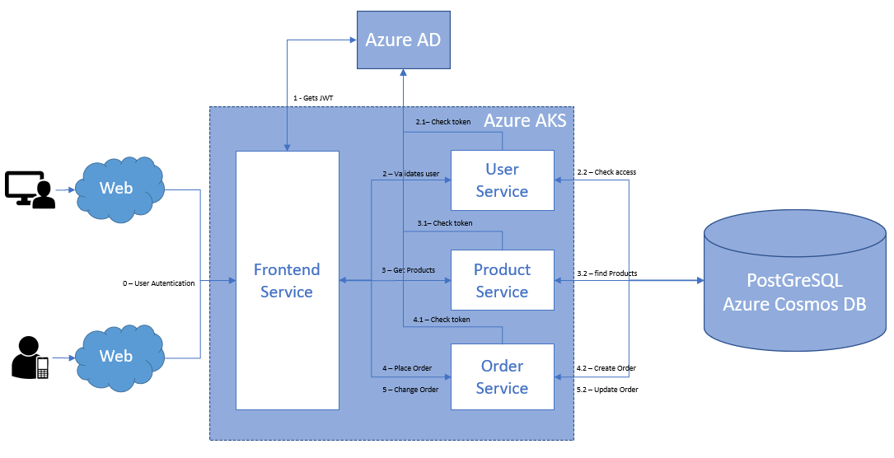

# Order Service

The Order Service handles the creation and updating of orders.

## Description

The Order Service, is responsible for managing user orders. It receives user selections for entry, main course, and beverages, storing the data in the database. Additionally, it provides functionality to retrieve a summary of ordered items, including their respective calorie counts and the total calories for the entire order.

## Architecture Diagram

## Database Diagram

## Technologies

- Java 17 with Spring Boot
- Java Database Connection (JDBC)
- JPA (with Hibernate)
- Spring Security (Azure AD for RestAPI Authentication)
- PostgreSQL (Azure Cosmos DB)
- OpenAPI

## Setup Instructions

1. Clone the repository: `git clone https://github.com/leombprojects/order-service.git`
2. Navigate to the `order-service` directory.
3. Configurations can be done in the boot module on the resources directory (`application-[env].yml`).
4. Build and run the service using your preferred IDE or `mvn spring-boot:run`.

## REST API Endpoints

- `POST /order-service/order/create`: Creates a new order.
- `PUT /order-service/order/update`: Updates a specific order, creating a new version of order items.

## Features

- **Azure DevOps Integration:**
    - Pipelines Ready
    - Releases Ready

- **Azure Cloud Services Compatibility:**
    - ACR (Azure Container Registry) Ready
    - AKS (Azure Kubernetes Service) Ready

- **Azure Cloud Identity and Access Compatibility:**
    - AD (Azure Active Directory) Ready - OAuth2 RestAPI Authentication

## Usage Notes

- Ensure that you configure the appropriate environment-specific properties in the `application-[env].yml` file.
- The service follows OpenAPI standards for documentation.